  

  

  
  

---

### 🕵️ About Me

- ⚡ I build hardware-software hybrids — from safety devices to game consoles running on bare microcontrollers
- 🛠️ Into embedded systems, PCB design, and real-time sensor-driven projects
- 🎮 Also enjoy building fun stuff on ESP32, like tiny game consoles with custom displays
- 🌱 Always tinkering with a new circuit, sensor, or microcontroller idea

---

### 🚀 Featured Projects

  
  

- 🪖 **[Smart-helmet-SOS](https://github.com/srz-dev/Smart-helmet-SOS)** — A hardware-based impact detection and emergency alert system using MPU6050 and a buzzer for real-time rider safety.
- 🐍 **[Snake Game on ESP32](https://github.com/srz-dev/SNAKE-GAME-ESP32-TFT-DISPLAY-PUSH_BUTTON)** — A classic Snake game built from scratch on an ESP32 with a TFT display and push-button controls.

---

### 🛠️ Tech Stack

  

### ⚙️ Engineering & Design Tools

  
  
  

### 💻 Platforms & Tools

  

---

### 📊 GitHub Stats

  
  

  

---

### 📫 Connect with Me

  
  
  

